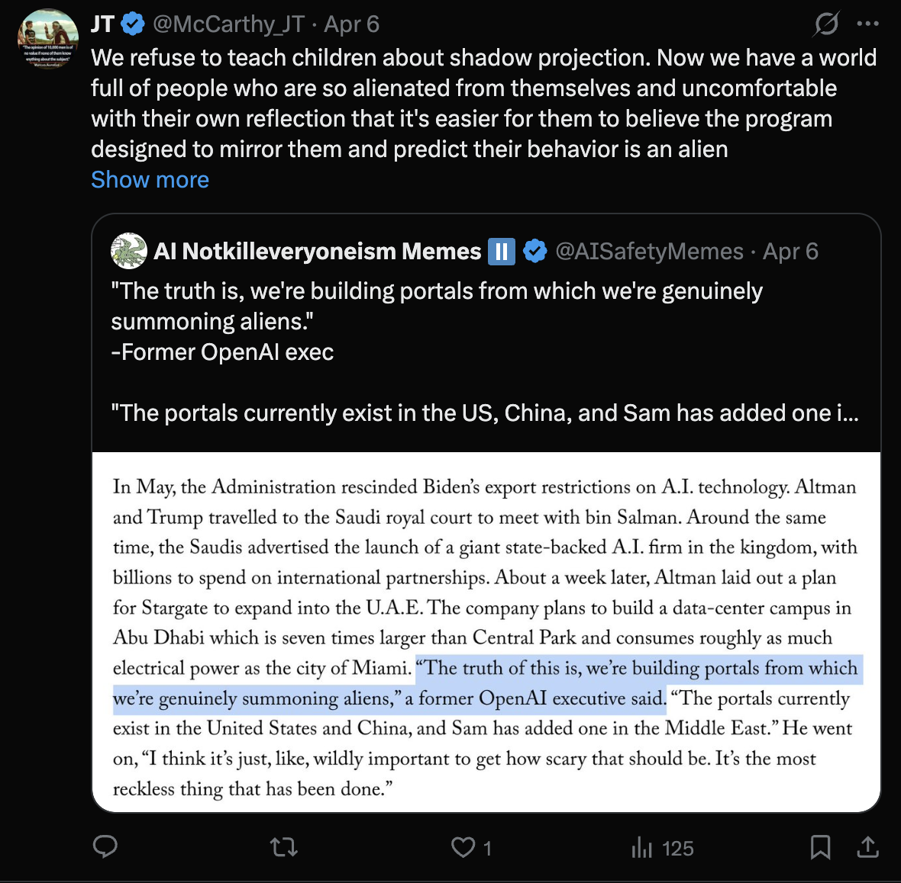

# Tweet text (visible portion — "Show more" was truncated in screenshot)

> We refuse to teach children about shadow projection. Now we have a world full of people who are so alienated from themselves and uncomfortable with their own reflection that it's easier for them to believe the program designed to mirror them and predict their behavior is an alien
>
> *[Show more…]*

## Quoting

@AISafetyMemes (Apr 6):

> "The truth is, we're building portals from which we're genuinely summoning aliens."
> —Former OpenAI exec
>
> "The portals currently exist in the US, China, and Sam has added one i…"

With embedded text excerpt:

> In May, the Administration rescinded Biden's export restrictions on A.I. technology. Altman and Trump travelled to the Saudi royal court to meet with bin Salman. … About a week later, Altman laid out a plan for Stargate to expand into the U.A.E. The company plans to build a data-center campus in Abu Dhabi which is seven times larger than Central Park and consumes roughly as much electrical power as the city of Miami. **"The truth of this is, we're building portals from which we're genuinely summoning aliens,"** a former OpenAI executive said. "The portals currently exist in the United States and China, and Sam has added one in the Middle East." He went on, "I think it's just, like, wildly important to get how scary that should be. It's the most reckless thing that has been done."

## Notes

- **One of the most synthesizing posts in the catalog.** Pulls together threads that elsewhere appear separate:
  - **AI / "summoning aliens"** — the AI thread from [[2026-04-25-technical-remote-viewing-ed-dames]] ("Context Engineering, AI") and the "Boomerdaddy's Data Centers" segment in [[2026-04-23-dungeoncore-against-the-archons]].
  - **Jungian psychology** — explicit reference to *shadow projection*. This is the psychological theory underneath his UFOx critique (cf. [[2026-04-24-ufox-inevitable-ruin]]'s "tidal wave of bad karma" list).
  - **Education / teaching** — "We refuse to teach children about…" — opens with a teaching frame. Most relevant single post in the catalog for understanding the *jtworldteacher* project naming.
- JT's reading of "AI as alien": people are projecting their own un-integrated shadow onto a system literally built to mirror them. NOT a debunking of the "summoning aliens" claim — it's a Jungian diagnosis of *why* people experience it that way.
- "Show more" was clipped — there is more tweet text not captured here. Worth re-screenshotting expanded if this catalog is used for serious analysis.
- The fact that JT is in dialogue with **@AISafetyMemes** content (an AI-x-risk-adjacent account) suggests his audience overlaps with AI safety / rationalist-adjacent corners of X, not just the UFO community.
- Connects directly to the **teaching/pedagogy core** of the `jtworldteacher` project: the implicit argument is *the right kind of teaching* (shadow integration, classical psychological literacy) is what's missing.
