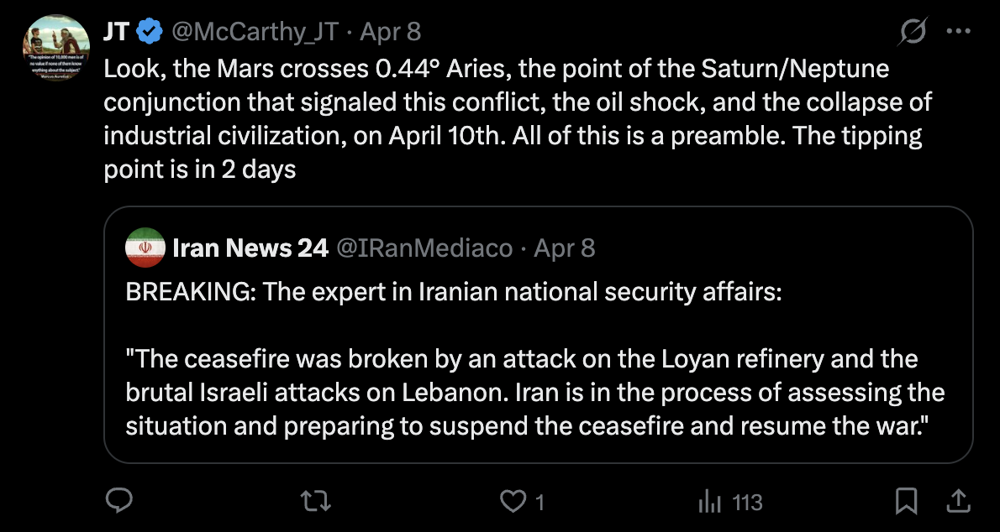

# Tweet text

> Look, the Mars crosses 0.44° Aries, the point of the Saturn/Neptune conjunction that signaled this conflict, the oil shock, and the collapse of industrial civilization, on April 10th. All of this is a preamble. The tipping point is in 2 days

## Quoting

@IRanMediaco · Apr 8:

> BREAKING: The expert in Iranian national security affairs:
>
> "The ceasefire was broken by an attack on the Loyan refinery and the brutal Israeli attacks on Lebanon. Iran is in the process of assessing the situation and preparing to suspend the ceasefire and resume the war."

## Notes

- **Mundane astrology** applied to live geopolitics — JT is reading the Iran/Israel conflict through Mars in Aries hitting the Saturn/Neptune conjunction point. This is the same "Astro RV / World Astrology Report" beat foreshadowed in [[2026-04-23-dungeoncore-against-the-archons]]'s segment list.
- Makes a **dated, falsifiable claim**: "the tipping point is in 2 days" (i.e. April 10, 2026). Worth tracking against what actually happened.
- Ties together two threads that look unrelated at first: his geopolitics commentary ([[2026-05-04-iran-ceasefire-commentary.md]]) and his astrology. The geopolitics posts aren't a hobby off to the side — they're *evidence* in his astrological/RV framework.
- "Saturn/Neptune conjunction that signaled this conflict" — implies this isn't a one-off chart read; he's been tracking this aspect across the conflict's arc.
- Tone: declarative, professorial ("Look, …"), no hedging. Same posture as [[2026-05-04-iran-ceasefire-commentary]] — the *other commentators are wrong; I see what's actually happening*.
