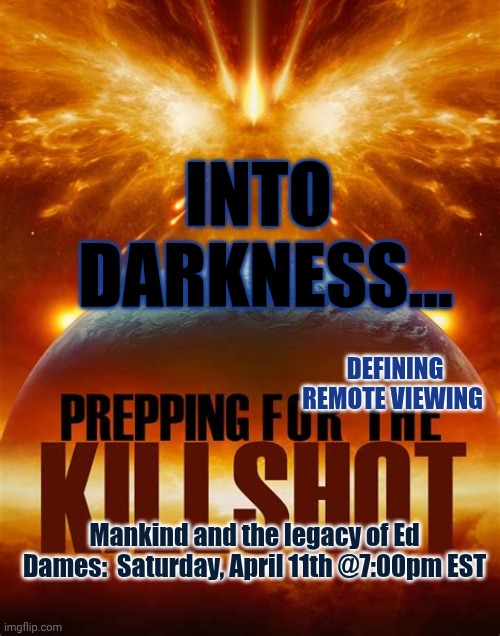

# Tweet text

(Screenshot is poster-only — tweet text and engagement not in frame.)

## Media

Apocalyptic image of Earth with a massive solar flare / explosion erupting above it:

- **INTO DARKNESS…** (blue, top)
- **DEFINING REMOTE VIEWING** (mid-right)
- **PREPPING FOR THE KILLSHOT** (yellow, large, on Earth's horizon)
- **Mankind and the legacy of Ed Dames: Saturday, April 11th @7:00pm EST**

## Notes

- **"The Killshot"** is Major Ed Dames' decades-long signature prediction: a catastrophic solar event (kill-shot from the sun) wiping out grids/civilization. This Space treats it seriously — "Prepping for" frames it as an actionable threat, not a discussion of whether it'll happen.
- Confirms the **Ed Dames thread** as central, not incidental — see also [[2026-04-25-technical-remote-viewing-ed-dames]] two weeks later, also titled around "the legacy of Major Ed Dames."
- "Defining Remote Viewing" appears again as a banner — same one used for the May 9 Space ([[2026-05-08-trvxn-defining-remote-viewing]]). It's a recurring series, not a one-off title.
- Saturday 7:00 PM EST slot — close cousin of the 7:30 PM Saturday slot for [[2026-04-25-technical-remote-viewing-ed-dames]].
- This is the most apocalyptic-register poster in the catalog so far — useful for understanding the urgency stance underlying the "Against the Archons" and UFOx critique posts.
