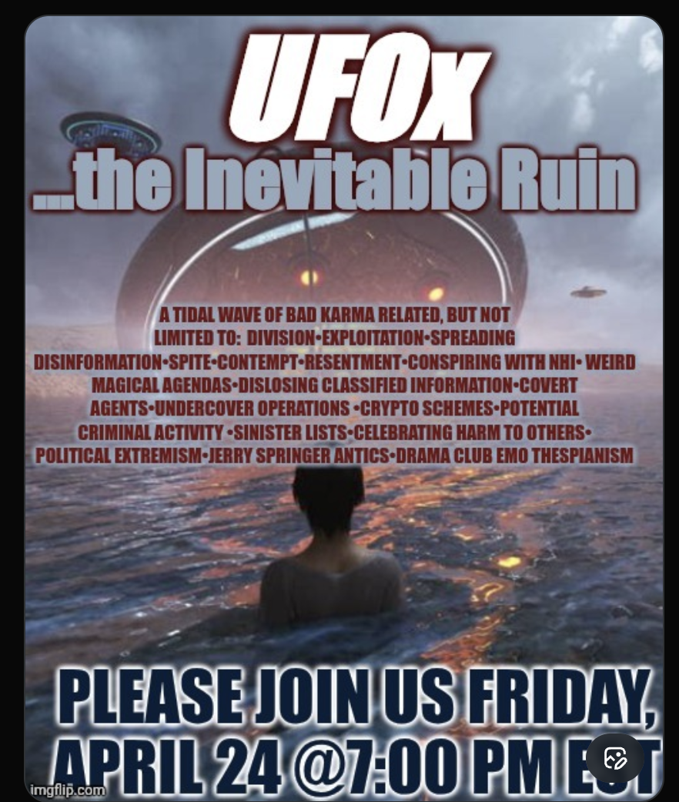

# Tweet text

(Screenshot is poster-only — tweet text and engagement not in frame.)

## Media

Sci-fi scene: figure sitting in glowing-red water under a hovering ringed UFO mothership, smaller UFO to the right. Heavy text overlay:

- **UFOx** (white, top)
- **…the Inevitable Ruin** (cyan)
- **A TIDAL WAVE OF BAD KARMA RELATED, BUT NOT LIMITED TO:** DIVISION • EXPLOITATION • SPREADING DISINFORMATION • SPITE • CONTEMPT • RESENTMENT • CONSPIRING WITH NHI • WEIRD MAGICAL AGENDAS • DISLOSING [sic] CLASSIFIED INFORMATION • COVERT AGENTS • UNDERCOVER OPERATIONS • CRYPTO SCHEMES • POTENTIAL CRIMINAL ACTIVITY • SINISTER LISTS • CELEBRATING HARM TO OTHERS • POLITICAL EXTREMISM • JERRY SPRINGER ANTICS • DRAMA CLUB EMO THESPIANISM
- **PLEASE JOIN US FRIDAY, APRIL 24 @ 7:00 PM E[DT]**

## Notes

- This is the **catalog of grievances** version of JT's UFOx critique — the long indictment list. Useful reference for the vocabulary and value system: division, disinfo, "conspiring with NHI," "weird magical agendas," classified leaks, covert agents, crypto scams, doxxing ("sinister lists"), political extremism, reality-TV-tier drama ("Jerry Springer antics," "drama club emo thespianism").
- Karmic / moral frame ("tidal wave of bad karma") — JT's critique is ethical/spiritual, not just informational.
- **NHI** = Non-Human Intelligence (standard UFO-discourse acronym). "Conspiring with NHI" treats NHI as real actors with agency, not just phenomena.
- Same UFOx brand as [[2026-05-07-ufox-crusade]] — clearly an ongoing series, not a one-off. The May 7 "Crusade" Space is the next beat in the same arc.
- Friday 7:00 PM EDT — different slot than the Thursday 6:30 and Saturday 7:30 patterns.
- Typo on the poster ("DISLOSING" → "DISCLOSING") — worth noting as part of authentic style; don't "fix" if quoting.
