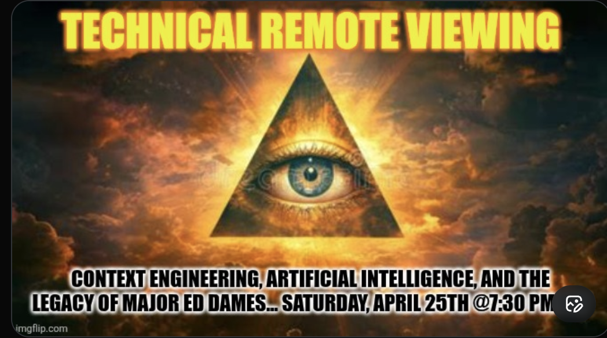

# Tweet text

(Screenshot is poster-only — tweet text and engagement not in frame.)

## Media

Classic Eye-of-Providence / all-seeing-eye-in-pyramid against a golden cloudy sky:

- **TECHNICAL REMOTE VIEWING** (yellow, top)
- **CONTEXT ENGINEERING, ARTIFICIAL INTELLIGENCE, AND THE LEGACY OF MAJOR ED DAMES… SATURDAY, APRIL 25TH @ 7:30 PM**

## Notes

- **Major Ed Dames** — career military intelligence officer, prominent (and controversial) figure in the Technical Remote Viewing world; instructor associated with Stargate Project lineage. JT framing his Space around Dames' "legacy" positions JT inside the TRV tradition rather than as an outsider critic.
- Notable: explicitly bringing **AI / "context engineering"** into the TRV conversation — combining classical TRV with modern AI tooling. This is the most concretely "teacher"-shaped post in the catalog so far, and is the most likely throughline for the `jtworldteacher` project.
- Recurring Saturday-evening Space slot (cf. [[2026-05-08-trvxn-defining-remote-viewing]] also Saturday).
- Visual: occult / Masonic iconography rather than the film-poster pastiche style of the other posters — signals this Space as more "doctrinal" / lineage-oriented.
