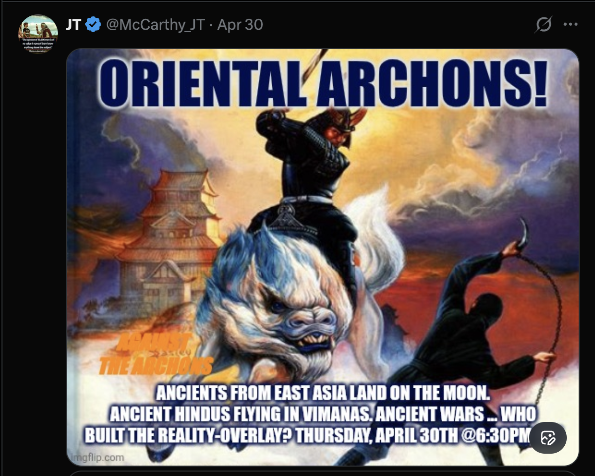

# Tweet text

(No text — image-only post promoting a Space.)

## Media

A fantasy-painting meme (imgflip.com) of a samurai on a white lion-beast with a ninja with kusarigama chain, pagoda burning in background:

- **ORIENTAL ARCHONS!** (blue, top)
- **AGAINST THE ARCHONS** (small orange, mid-left — recurring brand tag)
- **ANCIENTS FROM EAST ASIA LAND ON THE MOON. ANCIENT HINDUS FLYING IN VIMANAS. ANCIENT WARS … WHO BUILT THE REALITY-OVERLAY? THURSDAY, APRIL 30TH @ 6:30PM**

## Notes

- New recurring brand: **"Against the Archons"** — Gnostic-flavored framing (archons = malevolent rulers of the material world).
- Topic cluster: ancient astronaut / ancient advanced civilization material — moon landings by ancients, Hindu vimanas, "reality-overlay" framing.
- "Reality-overlay" suggests a simulation- or veil-style metaphysics overlapping with the Gnostic archon language.
- Same poster-meme + 6:30 PM Thursday Space slot pattern as [[2026-05-07-ufox-crusade]] — Thursdays appear to be a recurring Space slot.
- Visual aesthetic shifts per Space — Tron for TRvXN, Templar for Crusade, fantasy-Asian for Oriental Archons — title-card branding rather than a single visual identity.
