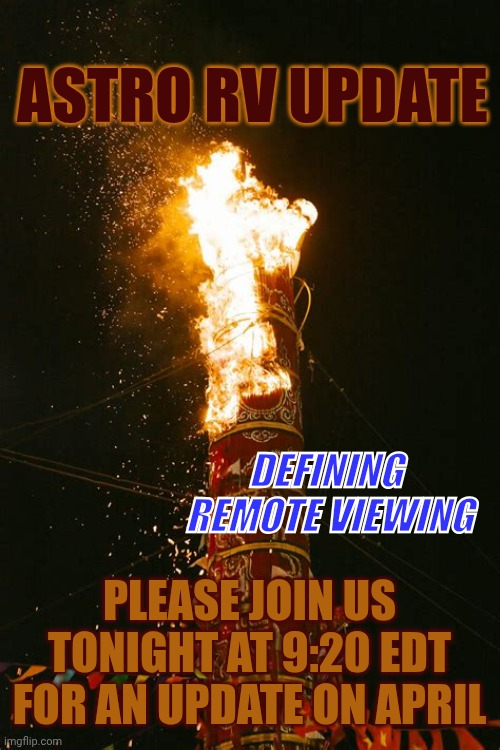

# Tweet text

(Screenshot is poster-only — no surrounding tweet text or date in frame.)

## Media

A flaming Chinese-style ceremonial torch / lantern column against black:

- **ASTRO RV UPDATE** (dark red, top)
- **DEFINING REMOTE VIEWING** (blue, mid-right)
- **PLEASE JOIN US TONIGHT AT 9:20 EDT FOR AN UPDATE ON APRIL**

## Notes

- **"Astro RV"** = Astrology + Remote Viewing. The full segment name is "Astro RV Exploitation" in [[2026-04-23-dungeoncore-against-the-archons]]'s rundown — here it appears standalone as the main banner, suggesting it's earned its own dedicated Space.
- **Monthly cadence** confirmed: "an update on April" implies he runs a monthly astrology+RV outlook Space, which fits the [[2026-04-08-mars-aries-tipping-point]] forecasting style.
- Same **"Defining Remote Viewing"** sub-banner used for [[2026-05-08-trvxn-defining-remote-viewing]] and [[2026-04-11-into-darkness-killshot]] — clearly his umbrella series, not an episode title.
- 9:20 EDT — oddly specific time, possibly tied to an astrological electional moment.
- **Date unknown** — frontmatter slug uses `XX`. If the user can find the original tweet, rename file and update `date:`. Most likely posted in early April 2026 (it's "an update on April" so probably posted to set up the month, not recap it).
