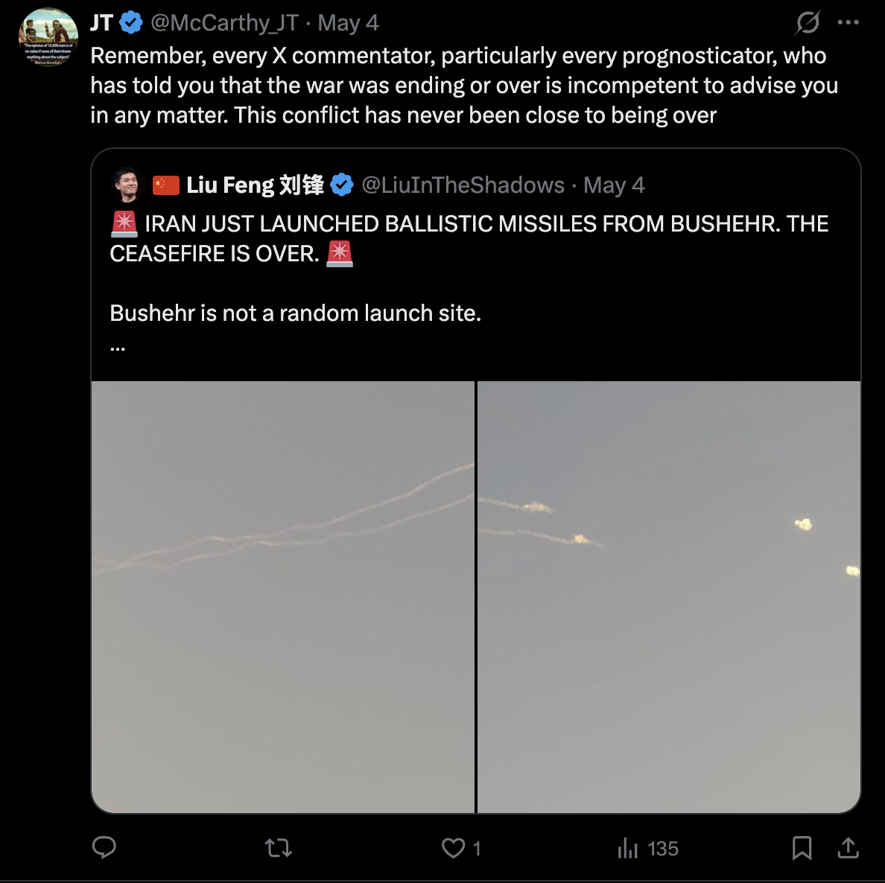

# Tweet text

> Remember, every X commentator, particularly every prognosticator, who has told you that the war was ending or over is incompetent to advise you in any matter. This conflict has never been close to being over

## Quoting

@LiuInTheShadows (May 4):

> 🚨 IRAN JUST LAUNCHED BALLISTIC MISSILES FROM BUSHEHR. THE CEASEFIRE IS OVER. 🚨
>
> Bushehr is not a random launch site.
> …
>
> (with video of missile trails over open sky)

## Notes

- Off-topic from his usual UFO/TRV beat — JT also comments on geopolitics, specifically the Iran conflict.
- Posture: contempt for "X commentators" / "prognosticators" who claimed the war was ending.
- Same recurring stance as in [[2026-05-07-ufox-crusade]] and [[2026-05-08-trvxn-defining-remote-viewing]]: existing online commentariat is incompetent; trust people who saw it coming.
- Tone: declarative, dismissive, no hedging.
- Low engagement (1 like, 135 views) — geopolitics posts seem to underperform vs his UFO/Spaces content.
