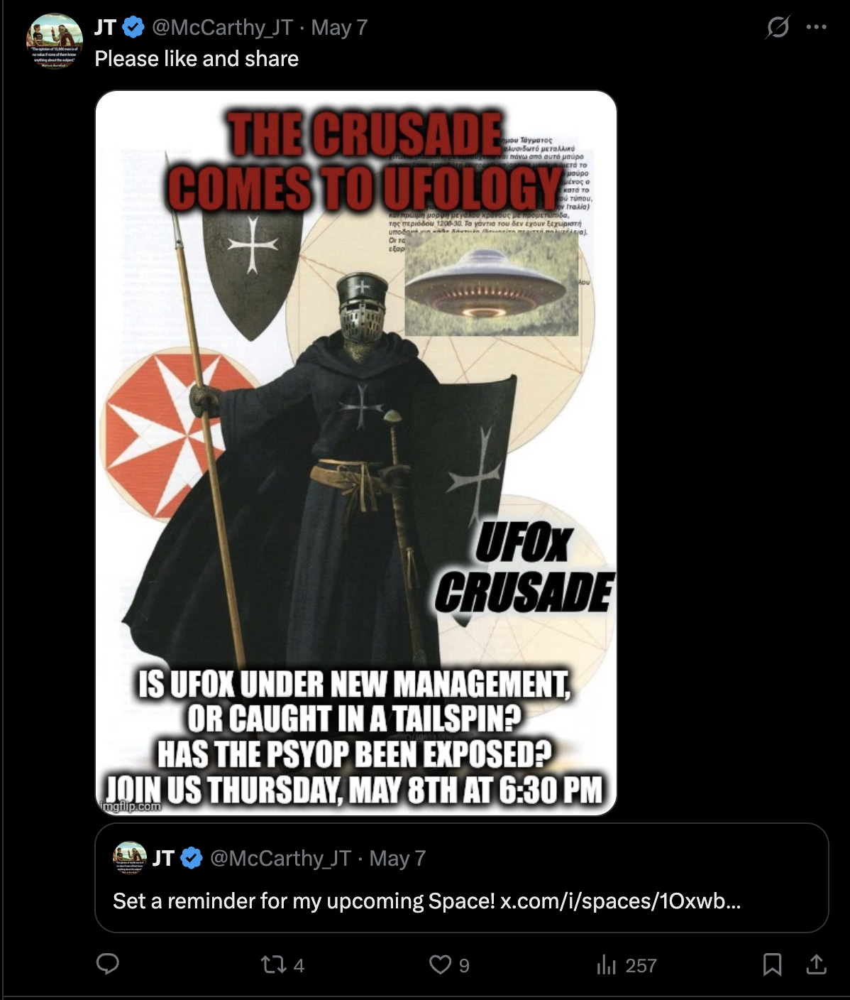

# Tweet text

> Please like and share

## Quoting

> Set a reminder for my upcoming Space! x.com/i/spaces/1Oxwb…

## Media

A meme poster (imgflip.com) of a black-robed Templar/Crusader knight with shield and spear, overlaid with a UFO photo and Greek-text manuscript snippets:

- **THE CRUSADE COMES TO UFOLOGY** (red, top)
- **UFOx CRUSADE** (right side)
- **IS UFOX UNDER NEW MANAGEMENT, OR CAUGHT IN A TAILSPIN? HAS THE PSYOP BEEN EXPOSED? JOIN US THURSDAY, MAY 8TH AT 6:30 PM**

## Notes

- Promotes a Space titled (effectively) "UFOx Crusade" — JT positions himself as crusading against a perceived "psyop" in the UFO-on-X community ("UFOx").
- Frames the discourse adversarially: "under new management," "tailspin," "psyop exposed."
- Religious/martial imagery (Templar) — recurring theme of righteous opposition vs. corrupted institution.
- Same imgflip.com / poster-meme template style as the [[2026-05-08-trvxn-defining-remote-viewing]] post — consistent visual brand.
- Better engagement than the TRvXN post (9 likes vs 2, 4 RTs vs 1) despite lower views — adversarial framing pulls more reaction.
