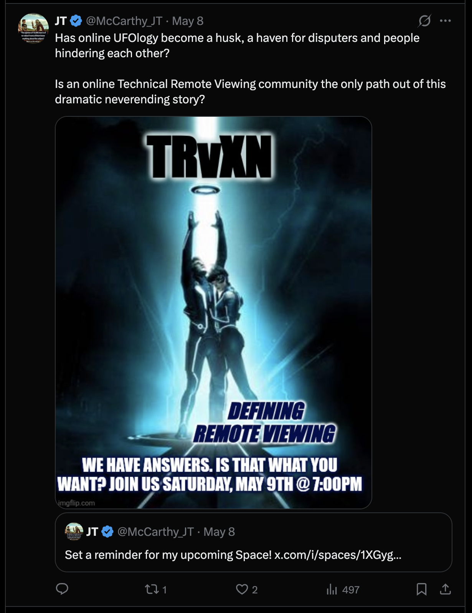

# Tweet text

> Has online UFOlogy become a husk, a haven for disputers and people hindering each other?
>
> Is an online Technical Remote Viewing community the only path out of this dramatic neverending story?

## Quoting

> Set a reminder for my upcoming Space! x.com/i/spaces/1XGyg…

## Media

A Tron-style poster meme (imgflip.com) reading:

- **TRvXN** (large title with halo)
- **DEFINING REMOTE VIEWING**
- **WE HAVE ANSWERS. IS THAT WHAT YOU WANT? JOIN US SATURDAY, MAY 9TH @ 7:00PM**

## Notes

- JT is promoting an X Space under the brand **TRvXN** ("Technical Remote Viewing" + "XN" — likely "X Network" or similar).
- Rhetorical framing: positions online UFOlogy as dysfunctional ("husk, haven for disputers"), proposes Technical Remote Viewing community as the alternative.
- Tone: provocative, gatekeeper-aware ("WE HAVE ANSWERS. IS THAT WHAT YOU WANT?") — challenges audience rather than courting them.
- Visual style: meme/film-poster pastiche, blue/cyberpunk aesthetic.
